# Flowcharts Lesson 2 pilot

**Status: AI-reviewed draft; nonproduction.** This package contains 40 MCQs and 8 structured-response questions. The full content review, corrections, blind review copies, calibration notes, and variety review are recorded here. No teacher or independent human approval is claimed.

## Actual flowchart stimuli

Chart-dependent questions point to the SVG file in `stimulusAsset`; the chart is part of the question and must be displayed with its stem. There are 26 MCQs and 5 structured responses with required diagrams. Twelve SVG charts were made from the supplied lesson's examples and rules and visually checked after rendering. `question_preview.html` actually displays all 31 diagram instances beside their question stems.

### Average of three values

Used by FLOW-006–008 and FLOW-E01.

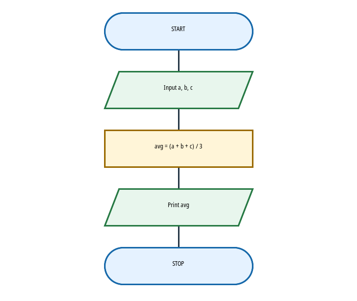

### Bonus decision

Used by FLOW-010–012, FLOW-039, and FLOW-E02.

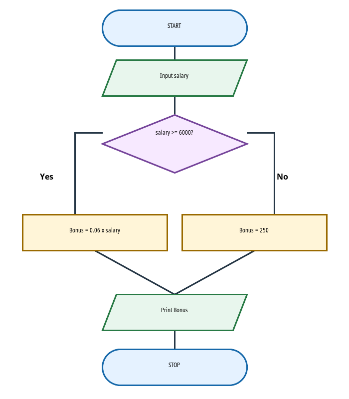

FLOW-012 also shows the faulty strict `>` variant to test the exact-threshold consequence.

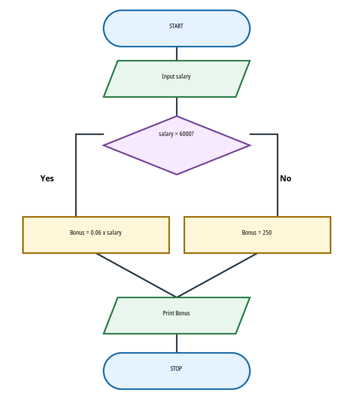

### Page connectors

Used by FLOW-014–015.

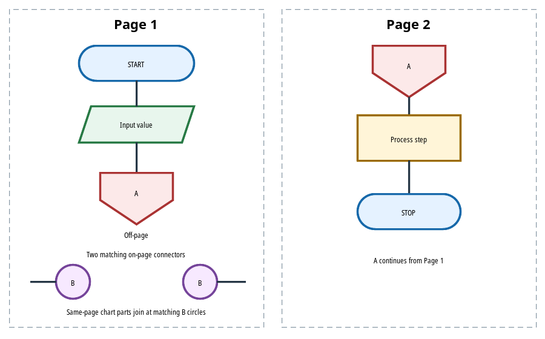

### Sum from 1 to 100

Used by FLOW-016–019, FLOW-022, FLOW-E03, and FLOW-E06.

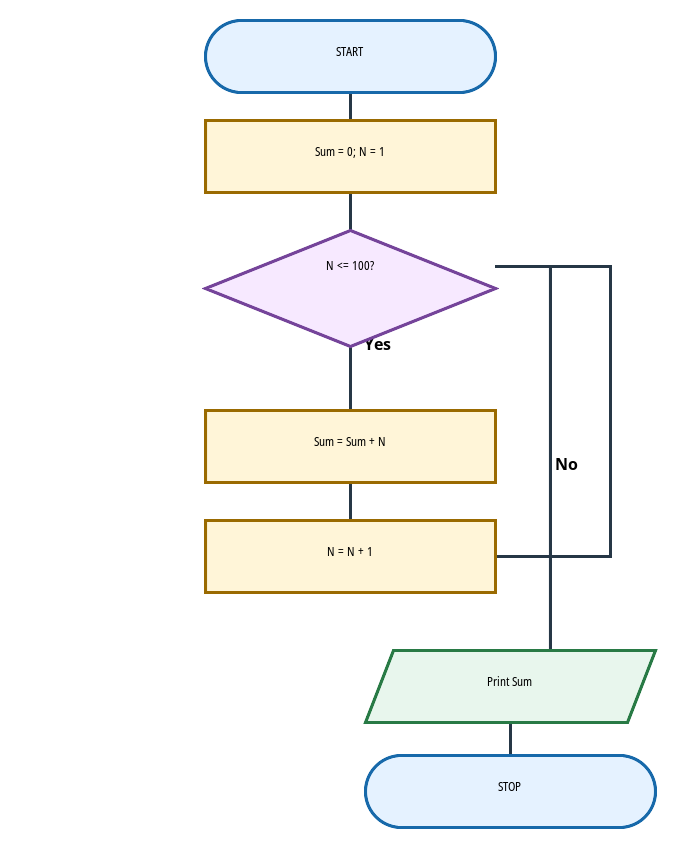

FLOW-022 uses a faulty variant with the counter update missing.

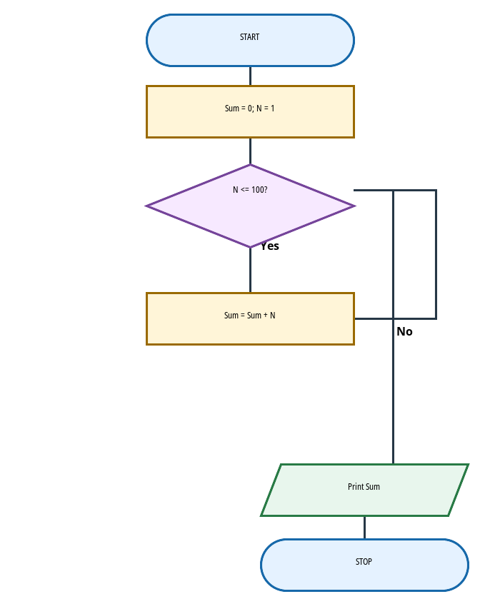

### Pre-test and post-test loops

Used by FLOW-020–021.

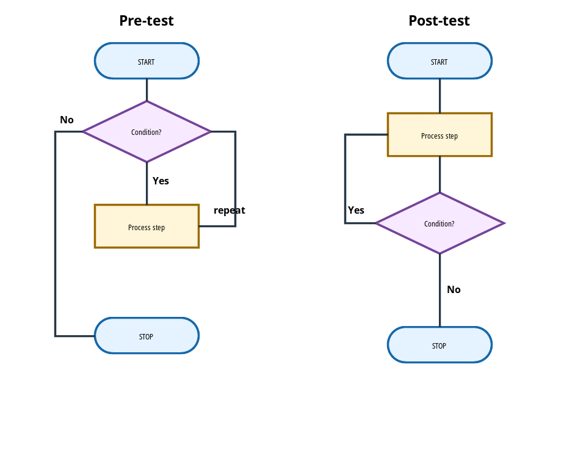

### Factorial

Used by FLOW-023–026 and FLOW-E04.

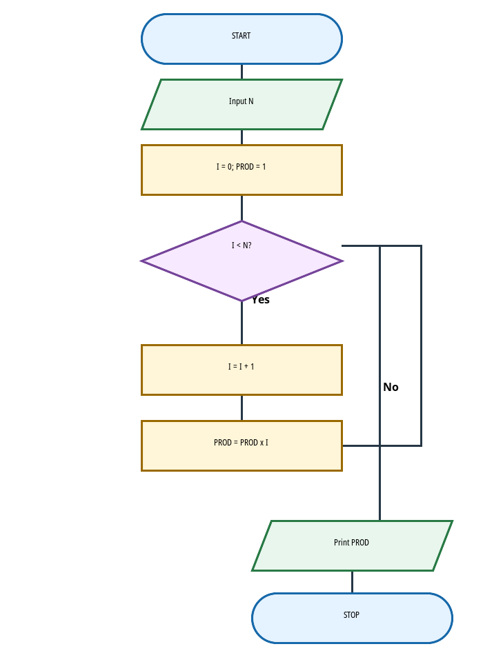

### Largest of three values

Used by FLOW-028. It follows the PDF's positive, unequal input example using a largest-so-far value.

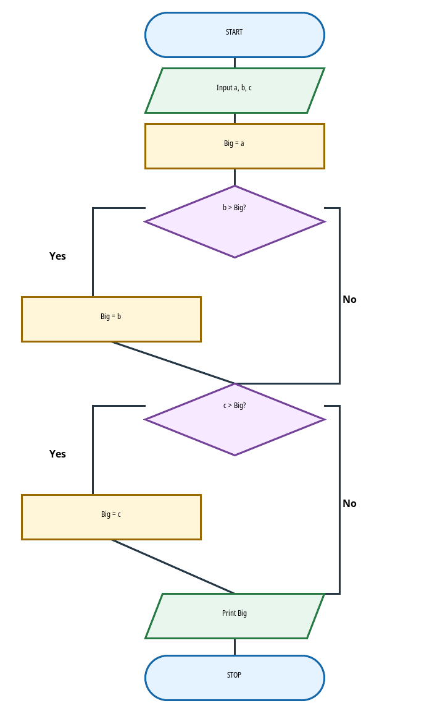

### Six-score accumulation

Used by FLOW-027 and FLOW-E08. The source diagram continues across PDF pages 19–20; this SVG redraws the complete sequence.

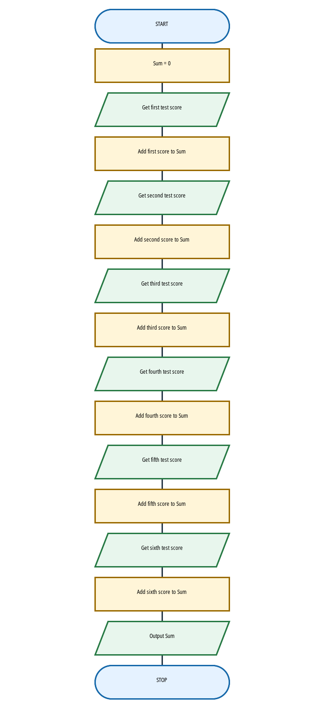

### Student pass/fail decision

Used by FLOW-033–035.

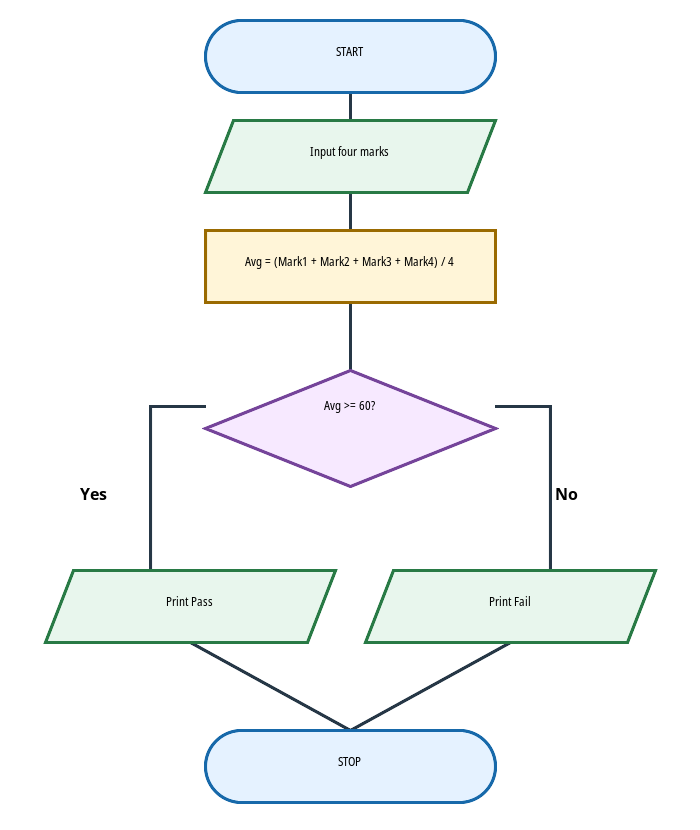

FLOW-029 shows a chart that ends at output without a terminal.

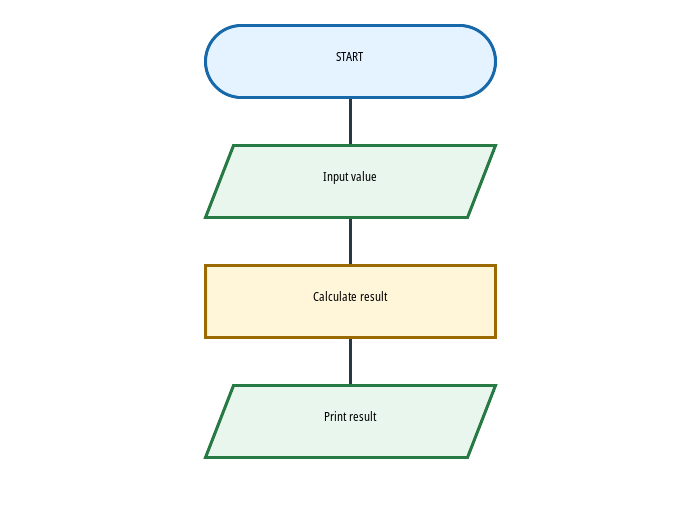

## Files

- `final_items.jsonl` — final 40 MCQs, keyed answers, explanations, and diagram asset references.
- `essay_items.jsonl` — 8 prompts with expected answers and five-point rubrics.
- `question_preview.html` — learner-style preview with the referenced SVGs rendered beside 40 MCQs and 8 structured responses; answers are hidden.
- `lesson_plan.json` and `essay_plan.json` — source coverage and task-operation map.
- `blind_review_input.jsonl` and `essay_review_input.jsonl` — review copies with planned objective/operation labels omitted.
- `review.md` and `essay_review.md` — findings, revisions, and focused re-audit.
- `variety_report.md` — operation-level repetition and source-coverage notes.
- `bloom_anchors_unlabeled.jsonl`, `bloom_anchors_key.json`, and `bloom_review.json` — calibration examples and descriptive classifications.
- `mechanical_audit.json` — structural counts and answer/rubric/asset checks.
- `diagrams/*.svg` — actual diagrams referenced by questions; matching PNG previews are included for quick viewing.
- `build_pilot.py` — small reproducible authoring script for the source-aligned SVGs and item files.
- `render_preview.py` — regenerates the visual question preview.

## Review outcome

- All 40 MCQs and all 8 structured responses passed the final AI review after revisions.
- Three MCQ issues were corrected (FLOW-023, FLOW-027, FLOW-029); FLOW-E05 was clarified. The visual-variety revision also changed FLOW-022 to diagnose a faulty loop and FLOW-028 to cover the maximum-of-three chart.
- SVG markup and branch routing were corrected after rendering checks; all twelve SVGs now render with readable symbols, labels, and arrows.
- MCQ answer positions are balanced 10 per option slot; keys match expected answers; all eight rubrics total five points.
- Exact normalized duplicate stems: 0. Procedural repetition remains visible and is described in `variety_report.md`.
- Bloom classification is updated in `bloom_review.json`; results are descriptive, low-confidence, and not quotas.

This pilot is not approved for app import. The question records reference SVG files; any later consumer must render those assets alongside the associated stems.

All eight essays include an explicit answer justification, model answer, and five-point rubric.

## Bloom’s taxonomy

Every MCQ and structured response has a provisional operation-based Bloom level and rationale in the item JSONL and `bloom_review_full.json`. Labels describe the highest cognitive process needed; no level quotas are imposed. This same-session AI classification has not received independent review.
